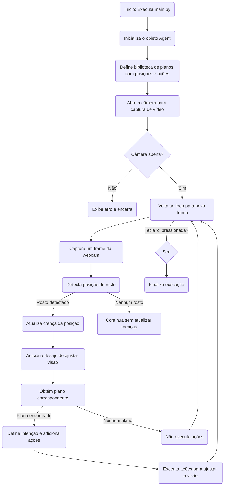

# agent_vision
## Coloquem outros milestones necessários para finalizar o projeto

- [ ] pedir pro prod Alison avaliar a modularização feita nessa implementação

- [ ] criar arquivo de motion.py

- [ ] testar o robô com o arquivo motion.py (atualmente o código não está modularizado como esse)

- [ ] chamar cython para partes do codigo que puderem compiladas em c (código otimizado)

- [ ] testar aquisição de imagem com câmera normal, abandonar o esp32-cam para diminuir overhead da transmissão de imagem por http

